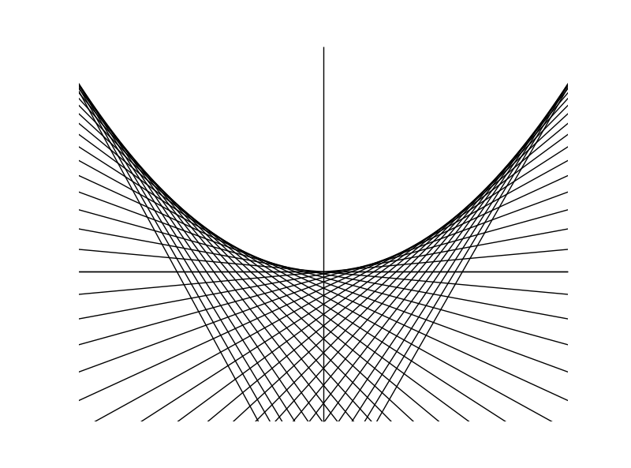
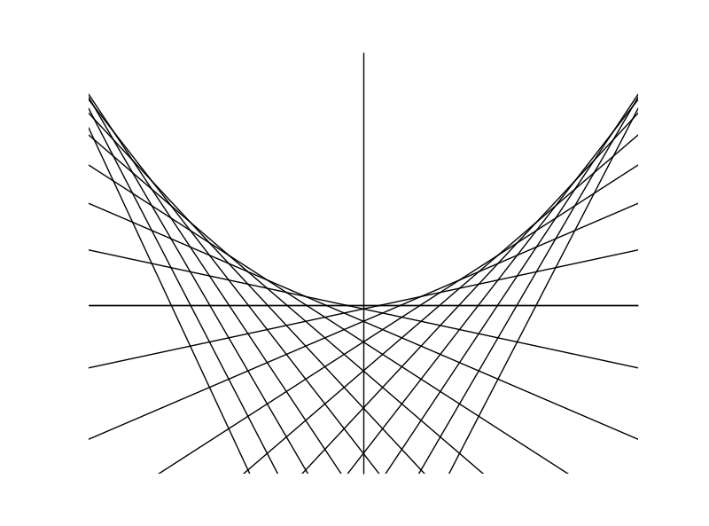

envelopetheorem
===============
���̃v���O�����̏o�͌��ʂł��F

[�w�i�ƃR�[�h�̐���]
(https://docs.google.com/viewer?url=https://github.com/iaris/envelopetheorem/blob/master/envelope-report.pdf?raw=true)
